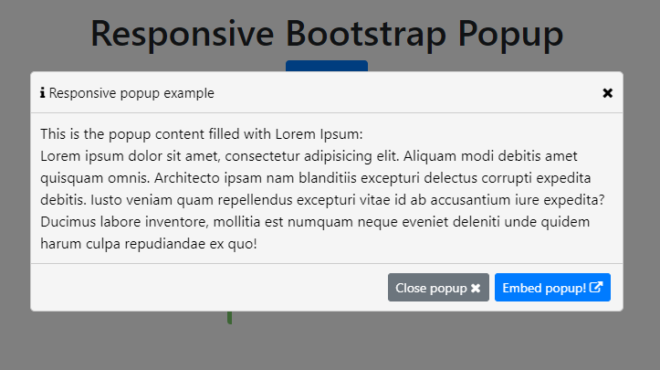
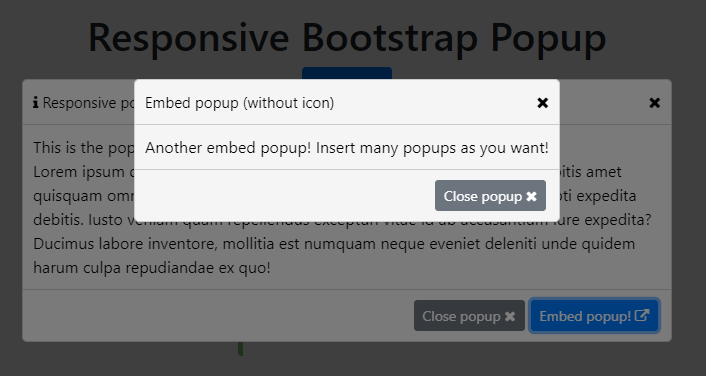
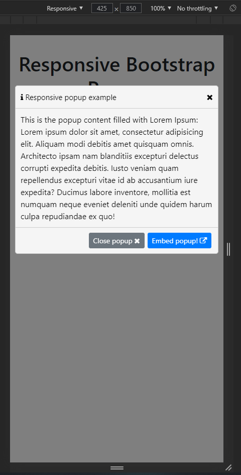

<p align="center">
    <a href="https://hits.seeyoufarm.com"></a>
</p>

---

# ResponsivePopup
Librería/Complemento para insertar popups en tu página web de forma sencilla.

_Library/Plugin to insert popups in your web page in a simple way._


## Requirements ⚙️
Requisitos necesarios para el correcto funcionamiento. Tu página debe disponer de los siguientes elementos.

_Necessary requirements for proper operation. Your page must have the following elements._

* [jQuery](https://code.jquery.com/) - Download link (NOT slim)
* [FontAwesome](https://fontawesome.com/v4.7.0/get-started/) - Download link
* [CSS](minified/cpopup.min.css) - CSS ResponsivePopup
* [JS](minified/cpopup.min.js) - JS ResponsivePopup


## How to use it 🔧
Lo primero de todo tendrás que incluir tanto el JS como el CSS de _ResponsivePopup_ en tu página HTML. También está disponible la versión minificada, archivos [aquí](minified/).

_First of all you will have to include both the JS and the CSS of _ResponsivePopup_ in your HTML page. The minified version is also available, files [here](minified/)._

```
<!-- inside <head> -->
<link rel="stylesheet" href="cpopup.css">
<script src="cpopup.js"></script>
```

Luego en tu código JS donde quieras crear un popup tan solo deberás llamar al objeto del plugin para crearlo, pasandole como parámetros el título, el nombre del icono de FontAwesome y la velocidad, siendo estos dos últimos opcionales.

_Then in your JS code where you want to create a popup, you just have to call the plugin object to create it, passing the title, the name of the FontAwesome icon and the speed as parameters, the latter two being optional._

```
var popup = CPOPUP.create('The title', 'info');
```

El código anterior te devolverá el wrapper del popup. A éste deberás asignarle un código HTML con el que podrás manejar después vía JS. Para cerrar cualquier popup tan solo tienes que llamar a:

_The above code will return the popup wrapper. You must assign an HTML code to this that you can use later via JS. To close any popup you just have to call:_

```
// title    : popup title [OPTIONAL]        -> String -> default: "info."
// icon     : popup icon [OPTIONAL]         -> String -> default: no icon
// speed    : popup close speed [OPTIONAL]  -> Number -> default: 250 (ms)
var popup = CPOPUP.create(title, icon, speed);
CPOPUP.close(popup);
```

---

El siguiente código muestra el esqueleto básico y obligatorio que debes incluir en el popup.

_The following code shows the basic and mandatory skeleton that you must include in the popup._

```
<div class="popup-body">
    <your_html_code_here>
</div>

<!-- footer optional -->
<div class="popup-actions">
    <your_html_code_here>
</div>
```

Puedes insertar poups donde quieras, ¡incluso dentro de un popup!

_You can insert poups wherever you want, even inside a popup!_


## Examples 📦
Para ver un ejemplo puedes descargar "example.html" y "example.js" para ver el funcionamiento del plugin.

_To see an example you can download "example.html" and "example.js" to see how the plugin works._








---
⌨️ with ❤️ by [csegundo](https://github.com/csegundo) 😊
